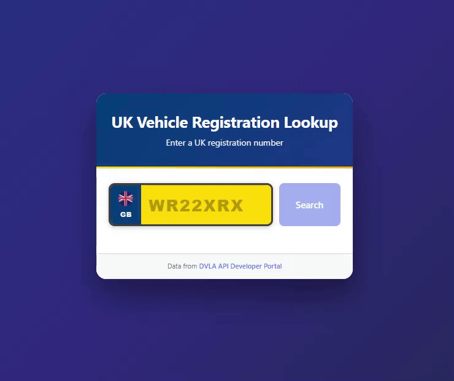

<div align="center">

# UK Vehicle Registration Lookup

Educational full-stack application demonstrating integration with the official DVLA Vehicle Enquiry API. Built to showcase modern web development practices with FastAPI and Svelte.



*Learn how to build a production-ready vehicle lookup system from scratch*

</div>

---

## What You'll Learn

This project demonstrates:

- **RESTful API Design** - FastAPI with proper error handling and validation
- **Modern Frontend** - Svelte with reactive state management
- **External API Integration** - DVLA government API consumption
- **Security Best Practices** - Environment variables and CORS configuration
- **Full-Stack Architecture** - Backend/frontend separation with proxy setup

---

## Tech Stack

**Frontend**
- Svelte 4 - Reactive UI framework
- Vite 5 - Fast build tool and dev server
- Vanilla CSS - Custom styled components

**Backend**
- FastAPI - Modern Python web framework
- HTTPX - Async HTTP client
- Pydantic - Data validation
- Python 3.10+ - Type hints and async/await

---

## Prerequisites

Before you start, make sure you have:

- **Python 3.10+** - [Download here](https://www.python.org/downloads/)
- **Node.js 18+** - [Download here](https://nodejs.org/)
- **DVLA API Key** - [Register here](https://developer-portal.driver-vehicle-licensing.api.gov.uk)
- **Git** - [Download here](https://git-scm.com/)
- **Code Editor** - VS Code recommended

---

## Getting Started

### Step 1: Clone the Repository

```bash
git clone https://github.com/joelmarodrigues/help-clamper.git
cd help-clamper
```

### Step 2: Backend Setup

```bash
# Navigate to backend directory
cd backend

# Create virtual environment
python -m venv .venv

# Activate virtual environment
# On Windows:
.venv\Scripts\activate
# On macOS/Linux:
source .venv/bin/activate

# Install dependencies
pip install -r requirements.txt

# Create .env file with your credentials
echo "DVLA_API_KEY=your_api_key_here" > .env
echo "ALLOWED_ORIGINS=http://localhost:5173" >> .env

# Start the backend server
uvicorn main:app --reload --port 8000
```

**You should see:**
```
INFO:     Uvicorn running on http://127.0.0.1:8000
INFO:     Application startup complete.
```

**Test it:** Open http://localhost:8000/docs to see the interactive API documentation.

---

### Step 3: Frontend Setup

Open a **new terminal** (keep the backend running):

```bash
# Navigate to frontend directory
cd frontend

# Install dependencies
npm install

# Start the development server
npm run dev
```

**You should see:**
```
  VITE v5.4.21  ready in 722 ms

  ➜  Local:   http://localhost:5173/
```

**Open the app:** Visit http://localhost:5173 in your browser.

---

### Step 4: Test the Application

1. Open http://localhost:5173
2. Enter a UK registration plate (try `WR22XRX` or `PL22YWB`)
3. Click "Search"
4. View the vehicle details returned from the DVLA API

---

## Project Structure

```
help-clamper/
│
├── backend/                      # Python FastAPI backend
│   ├── main.py                  # API routes and configuration
│   ├── requirements.txt         # Python dependencies
│   ├── .env                     # Environment variables (create this)
│   └── .env.example            # Example environment file
│
├── frontend/                     # Svelte frontend
│   ├── src/
│   │   ├── App.svelte          # Main application component
│   │   ├── main.js             # Application entry point
│   │   └── app.css             # Global styles
│   ├── public/
│   │   ├── icons/              # App icons and images
│   │   ├── manifest.webmanifest # PWA configuration
│   │   └── service-worker.js   # Offline functionality
│   ├── vite.config.js          # Vite build configuration
│   ├── svelte.config.js        # Svelte compiler config
│   └── package.json            # Node dependencies
│
├── LICENSE                       # MIT License
└── README.md                     # This file
```

---

## How It Works

### Architecture Overview

```
┌─────────────┐      HTTP POST      ┌──────────────┐      HTTPS      ┌─────────────┐
│   Browser   │ ─────────────────→  │   FastAPI    │ ──────────────→ │  DVLA API   │
│ (localhost: │  { plate: "..." }   │   Backend    │  + API Key      │ (gov.uk)    │
│    5173)    │ ←─────────────────  │ (localhost:  │ ←──────────────  │             │
└─────────────┘  Vehicle details    │    8000)     │  JSON response  └─────────────┘
                                     └──────────────┘
```

### Request Flow

1. **User Input** - User enters registration plate in the frontend
2. **Frontend Validation** - Svelte validates format and sends POST to `/lookup`
3. **Backend Processing** - FastAPI receives request, normalizes plate format
4. **DVLA API Call** - Backend forwards request to DVLA with API key
5. **Data Processing** - Backend receives and validates DVLA response
6. **Response** - Frontend displays formatted vehicle details

### Key Features Explained

**Backend (FastAPI)**
- **Async Operations** - Non-blocking HTTP requests for better performance
- **Data Validation** - Pydantic models ensure type safety
- **Error Handling** - Graceful failures with proper HTTP status codes
- **CORS Support** - Allows frontend on different port to make requests

**Frontend (Svelte)**
- **Reactive State** - UI updates automatically when data changes
- **Component Architecture** - Single file components (HTML + CSS + JS)
- **Proxy Configuration** - Vite dev server proxies API requests
- **UK Plate Styling** - Custom CSS mimics real UK number plates

---

## API Reference

### POST /lookup

Retrieve vehicle details by registration number.

**Endpoint:** `http://localhost:8000/lookup`

**Request:**
```json
{
  "plate": "WR22XRX"
}
```

**Success Response (200):**
```json
{
  "make": "MERCEDES-BENZ",
  "colour": "GREY",
  "year_of_manufacture": 2022,
  "fuel_type": "ELECTRICITY"
}
```

**Error Response (404):**
```json
{
  "detail": "Vehicle not found"
}
```

**Try it yourself:**
```bash
curl -X POST http://localhost:8000/lookup \
  -H "Content-Type: application/json" \
  -d '{"plate":"WR22XRX"}'
```

---

### GET /health

Health check endpoint to verify backend is running.

**Endpoint:** `http://localhost:8000/health`

**Response (200):**
```json
{
  "ok": true
}
```

**Try it yourself:**
```bash
curl http://localhost:8000/health
```

---

## Configuration

### Backend Environment Variables

Create `backend/.env` with:

```bash
# Required: Your DVLA API key
DVLA_API_KEY=your_api_key_here

# Required: Allowed origins for CORS
ALLOWED_ORIGINS=http://localhost:5173
```

**Getting a DVLA API Key:**
1. Visit https://developer-portal.driver-vehicle-licensing.api.gov.uk
2. Create an account
3. Subscribe to "Vehicle Enquiry Service API"
4. Copy your API key to `.env`

### Frontend Proxy Configuration

The `frontend/vite.config.js` automatically proxies API requests during development:

```javascript
// Requests to /lookup are forwarded to http://localhost:8000/lookup
server: {
  proxy: {
    '/lookup': {
      target: 'http://localhost:8000',
      changeOrigin: true
    }
  }
}
```

This eliminates CORS issues during development.

---

## Troubleshooting

### Backend won't start

**Problem:** `ModuleNotFoundError: No module named 'fastapi'`

**Solution:**
```bash
# Make sure virtual environment is activated
.venv\Scripts\activate  # Windows
source .venv/bin/activate  # macOS/Linux

# Reinstall dependencies
pip install -r requirements.txt
```

---

### Frontend shows connection error

**Problem:** `Failed to fetch` or CORS error

**Solution:**
1. Make sure backend is running on port 8000
2. Check `backend/.env` has `ALLOWED_ORIGINS=http://localhost:5173`
3. Restart both servers

---

### DVLA API returns 403 Forbidden

**Problem:** Invalid or missing API key

**Solution:**
1. Verify API key in `backend/.env`
2. Check key is active at https://developer-portal.driver-vehicle-licensing.api.gov.uk
3. Ensure no extra spaces in `.env` file

---

## Learning Resources

**FastAPI**
- [Official Documentation](https://fastapi.tiangolo.com)
- [Python Type Hints](https://docs.python.org/3/library/typing.html)
- [Async/Await in Python](https://realpython.com/async-io-python/)

**Svelte**
- [Interactive Tutorial](https://svelte.dev/tutorial)
- [API Documentation](https://svelte.dev/docs)
- [Svelte REPL](https://svelte.dev/repl) - Try code in browser

**Vite**
- [Getting Started](https://vitejs.dev/guide/)
- [Configuration Reference](https://vitejs.dev/config/)

**DVLA API**
- [Developer Portal](https://developer-portal.driver-vehicle-licensing.api.gov.uk)
- [API Documentation](https://developer-portal.driver-vehicle-licensing.api.gov.uk/apis/vehicle-enquiry-service/v1.1.0.html)

---


## License

MIT License - See [LICENSE](LICENSE) file for details.

You are free to use this code for learning, personal projects, or commercial applications.

---

## Acknowledgments

Vehicle data provided by the UK Driver and Vehicle Licensing Agency (DVLA) via their official Vehicle Enquiry Service API.

This is an educational project and is not affiliated with or endorsed by DVLA.

---

## Questions?

If you have questions about this project:

1. Check the [Issues](https://github.com/joelmarodrigues/help-clamper/issues) page
2. Read the inline code comments (heavily documented for learning)
3. Consult the official documentation for each technology